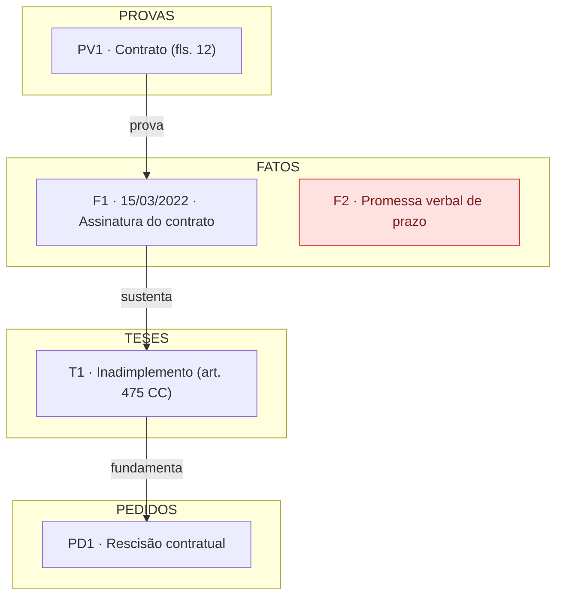
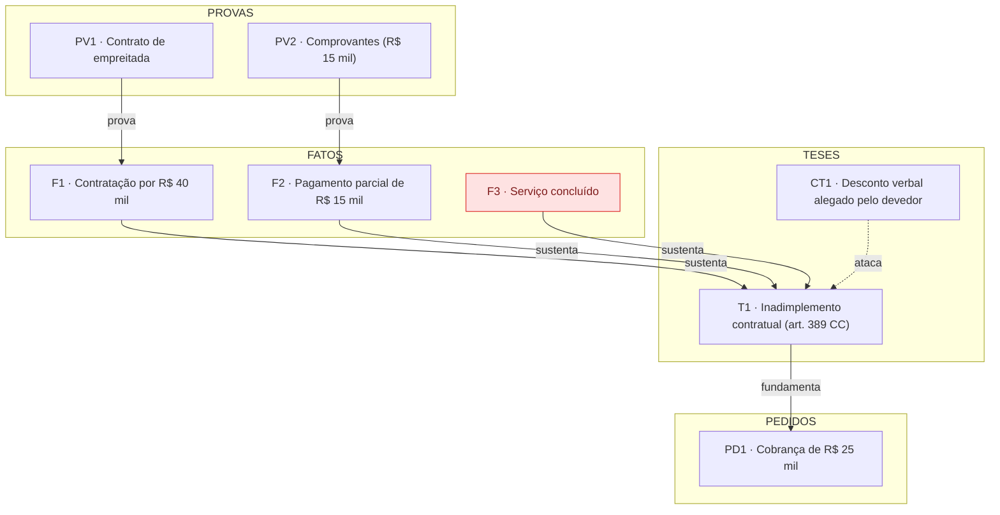

# Mapa de Caso

Uma peça convence quando cada pedido desce, sem degrau quebrado, até uma prova nos autos: **pedido ← tese ← fato ← prova**. O mapa de caso torna essa cadeia visível antes da redação, quando ainda há tempo de juntar um documento, pesquisar um precedente ou reposicionar uma tese. Depois de protocolada a peça, cada elo faltante vira munição da parte contrária.

O mapa é ferramenta de trabalho interna do advogado. Ele não vai para os autos — ele decide o que vai para os autos.

## Etapa 1 — Coleta

Leia tudo o que o usuário forneceu: narrativa, contratos, e-mails, decisões, PDFs anexados, ou o que já foi discutido na conversa. Antes de montar qualquer coisa, confirme apenas o essencial se não estiver claro:

- **Qual peça será redigida** (inicial, contestação, réplica, recurso, parecer)?
- **Qual lado é o cliente?**

Não interrogue o usuário para preencher o mapa — monte com o que existe e deixe o que falta aparecer como lacuna no diagnóstico. Lacuna visível é exatamente o produto que esta skill entrega.

Quando o cliente está no polo passivo, a narrativa da parte contrária também entra no mapa: os fatos que ela alega (marcados como "alegado pela autora"), as provas que ela juntou e as teses dela — que aqui viram contra-teses a neutralizar.

## Etapa 2 — Inventário de nós

Extraia os elementos do caso nestes tipos, com IDs curtos e prefixados:

| Prefixo | Tipo | O que entra |
|---------|------|-------------|
| `P` | Parte/envolvido | Autor, réu, terceiro, testemunha, juízo — com o papel de cada um |
| `F` | Fato | Um evento datado. Um fato = um evento, não um parágrafo. Divida fatos compostos |
| `PV` | Prova | Documento, testemunha, perícia, e-mail — com localização (fls., anexo) quando houver |
| `T` | Tese | O fundamento jurídico: a regra aplicada ao fato (com o dispositivo legal, se conhecido) |
| `PD` | Pedido | Cada pedido da peça, separadamente |
| `PR` | Precedente/norma | Julgado ou dispositivo que reforça uma tese — somente os verificados |
| `CT` | Contra-tese | Argumento da parte contrária, real (já apresentado) ou previsível |

Dois cuidados que mudam a qualidade do mapa:

- **Datas importam sempre.** Fato sem data é candidato a contradição futura; anote a data ou marque "data não informada".
- **Antecipe as contra-teses mesmo na inicial.** Pergunte-se: o que a defesa vai dizer? Prescrição? Ilegitimidade? Culpa exclusiva? Cada resposta é um nó `CT` — e a peça fica mais forte quando já nasce vacinada.

## Etapa 3 — Relações

Ligue os nós com estas arestas tipadas:

| Aresta | Significado |
|--------|-------------|
| `PV -->\|prova\| F` | A prova demonstra o fato |
| `F -->\|sustenta\| T` | O fato atrai a incidência da tese |
| `T -->\|fundamenta\| PD` | A tese justifica o pedido |
| `PR -->\|reforça\| T` | O precedente/norma dá autoridade à tese |
| `CT -.->\|ataca\| T` | A contra-tese mira esta tese (linha tracejada) |
| `F1 -.-\|contradiz\| F2` | Dois fatos/versões incompatíveis (especialmente datas) |
| `T -->\|responde\| CT` | Tese defensiva que neutraliza uma contra-tese |

A cadeia que interessa é sempre **PD ← T ← F ← PV**. Percorra cada pedido de cima para baixo e verifique se chega a uma prova.

## Etapa 4 — Diagnóstico de lacunas

Este é o coração da skill. Rode o checklist inteiro e classifique cada achado:

| # | Lacuna | Como detectar | Severidade típica |
|---|--------|---------------|-------------------|
| 1 | **Alegação órfã** | `F` sem nenhuma aresta `prova` chegando | 🔴 se o fato é essencial ao pedido; 🟡 se acessório |
| 2 | **Pedido descoberto** | `PD` cuja cadeia não desce até um `PV` | 🔴 |
| 3 | **Tese nua** | `T` sem `PR` (sem norma nem precedente) | 🟡 — vira pendência de pesquisa |
| 4 | **Contradição** | `F -.- F` incompatíveis, sobretudo datas | 🔴 se na narrativa do cliente; se na da parte contrária, é trunfo — destaque |
| 5 | **Contra-tese aberta** | `CT` sem nenhuma `T` respondendo | 🟡 a 🔴 conforme a gravidade |
| 6 | **Prova solta** | `PV` que não prova nenhum `F` alegado | 🟡 — oportunidade (fato não narrado?) ou descarte |
| 7 | **Prova frágil** | Testemunha suspeita/impedida, documento sem assinatura, print sem ata notarial, laudo unilateral | 🟡 |

Severidade: **🔴 bloqueia** = corrigir antes de protocolar (juntar prova, repensar pedido, resolver contradição). **🟡 atenção** = administrável, mas precisa de decisão consciente do advogado.

Não invente fatos nem suponha provas para fechar lacunas. O mapa vale pelo que revela do caso como ele é — uma lacuna aberta é informação, não defeito do mapa.

## Etapa 5 — Jurisprudência

Se as ferramentas de pesquisa jurisprudencial (JusRatio) estiverem disponíveis na sessão:

- Pesquise precedentes para cada **tese nua** (lacuna nº 3), priorizando as de severidade mais alta. A cota é mensal — agrupe pesquisas e vá direto ao ponto.
- Priorize autoridade **A** (vinculante) e **B** (precedente qualificado); registre tribunal, órgão, relator e data.
- Pesquise também o que a parte contrária vai citar: precedente desfavorável conhecido antes vale mais que surpresa na réplica.

Se não estiverem disponíveis, registre cada tese nua como **pendência de pesquisa** no relatório final.

**Nunca cite julgado que não foi verificado nesta sessão ou fornecido pelo usuário.** Número de processo, tribunal ou tese "de memória" não entram no mapa — jurisprudência inventada em peça é dano real ao cliente e ao advogado. Na dúvida, "pendente de verificação".

## Etapa 6 — Saída

Entregue sempre neste formato:

```markdown
# Mapa do Caso — [identificação curta]

## 1. Resumo
[3 a 6 linhas: quem, contra quem, o quê, estado atual]

## 2. Mapa
[diagrama Mermaid — convenções abaixo]

## 3. Cronologia
| Data | Fato | Prova | Obs |

## 4. Matriz de amarração
| Pedido | Tese | Fato(s) | Prova(s) | Precedente/Norma | Status |
[Status: 🟢 amarrado · 🟡 atenção · 🔴 lacuna]

## 5. Lacunas e ações
### 🔴 Corrigir antes de protocolar
- [lacuna] → [ação concreta: "juntar comprovante X", "pesquisar precedente sobre Y", "reposicionar pedido Z"]
### 🟡 Pontos de atenção
- ...

## 6. Próximo passo
[oferta de redigir a peça a partir do mapa]
```

Convenções do Mermaid (para renderizar bem):



- IDs curtos nos rótulos (`F1 · data · descrição curta`); sem `|`, chaves ou parênteses desbalanceados dentro dos rótulos; use aspas.
- Pinte com `class`: vermelho = lacuna, amarelo = atenção, verde opcional para cadeias fechadas.
- Acima de ~25 nós o diagrama vira poluição: divida em um mapa por pedido (ou por tema) e mantenha um mapa geral só de pedidos ↔ teses.

Entregue o mapa na própria conversa. Se o caso for grande ou o usuário quiser guardar, salve também como arquivo `.md`; se houver como publicar uma visualização renderizada (artifact/HTML), ofereça.

## Do mapa à peça

Se o usuário aceitar seguir para a redação, o mapa vira o esqueleto:

- **Dos Fatos** = a cronologia (seção 3) em prosa, na ordem das datas, cada fato já com sua prova referenciada.
- **Do Direito** = um bloco por pedido, percorrendo a cadeia de baixo para cima: enuncia a tese, aplica ao fato, aponta a prova, cita o precedente verificado.
- **Contra-teses** viram tópicos de refutação preventiva (na contestação, invertem-se: cada tese da autora vira uma seção de defesa).
- **Pedidos** = a lista de `PD`, na ordem de dependência lógica.

Para gerar o documento final formatado (timbrado, DOCX/PDF), use a skill `peticao-rg` se estiver disponível.

## Exemplo compacto

Entrada: "Cliente prestou serviço de reforma, R$ 40 mil, cliente dele pagou só 15. Tenho o contrato e os comprovantes de transferência. Ele diz que combinou desconto por telefone. Quero cobrar a diferença."

Saída (resumida):



| Pedido | Tese | Fatos | Provas | Precedente | Status |
|--------|------|-------|--------|------------|--------|
| PD1 Cobrança R$ 25 mil | T1 Inadimplemento | F1, F2, F3 | PV1, PV2 | pendente | 🟡 |

- 🔴 **F3 (serviço concluído) está órfão** — sem prova de conclusão, a defesa alega inexecução. Ação: juntar fotos, termo de entrega ou e-mails de aceite.
- 🟡 **CT1 aberta** — o desconto verbal não tem resposta. Ação: quem alega desconto prova (art. 373, II, CPC); preparar tese.
- 🟡 **T1 sem precedente** — pendência de pesquisa.

## Limites

- O mapa é uso interno do escritório; não junte aos autos nem envie à parte contrária.
- A decisão final sobre teses, pedidos e protocolo é sempre do advogado — a skill estrutura e aponta, não decide (supervisão humana conforme Res. CNJ 615/2025).
- Lacuna sem solução também é resultado: às vezes o mapa mostra que o caso precisa de mais prova antes de valer o ajuizamento — dizer isso com clareza é parte do trabalho.
