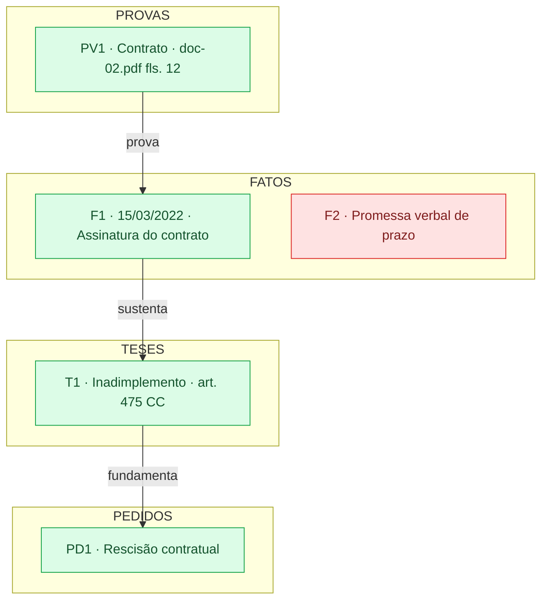

# Diagrama

O diagrama é opcional e derivado — a matriz de amarração é a fonte de verdade. Gere quando o usuário pedir ou quando o caso tiver mais de duas partes ou mais de quatro pedidos, situações em que o desenho de fato ajuda a enxergar o encadeamento.

Lembre onde ele **não** funciona: Mermaid não renderiza em Word, em e-mail, no PJe nem no papel. Se o mapa vai ser lido fora de um ambiente que renderiza, a matriz sozinha serve melhor.

## Sintaxe defensiva

Regras que evitam erro de parse — testadas, não supostas:

- **Todo rótulo de nó entre aspas duplas**: `F1["F1 · 15/03/2022 · Assinatura do contrato"]`. Sem aspas, parênteses e colchetes quebram o parse.
- **Nunca aspas duplas dentro do rótulo** — use aspas simples se precisar.
- **Rótulo de aresta** (entre `|...|`) aceita só letras, números, espaço, ponto, vírgula e hífen. Nada de `(`, `[`, `{` ou `|` — `-->|prova (fls. 12)|` é erro de sintaxe garantido.
- **Localização da prova vai no rótulo do nó**, nunca no da aresta: `PV1["PV1 · Contrato · doc-02.pdf fls. 12"]`.
- Só Mermaid dentro do bloco — nenhuma linha de prosa, comentário ou markdown.
- `§`, `º`, `R$`, `%` e acentos funcionam normalmente dentro das aspas.

Se o diagrama não renderizar, leia a mensagem de erro, corrija e reemita. Não entregue diagrama quebrado.

## Convenções

## Fecho obrigatório

Antes de entregar, confira linha a linha:

- **Todo `PD` da matriz existe como nó** em algum diagrama. Nunca omita um pedido "para não poluir" — se não couber, divida.
- **A cor bate com o Status da matriz**: 🟢 → `ok`, 🟡 → `atencao`, 🔴 → `lacuna`.
- **Nenhum nó fica sem classe.** Nó sem cor é erro de montagem, e some justamente a lacuna que o diagrama existia para mostrar. `F` controvertido sem prova chegando é `lacuna`, sem exceção. `CT` sem `responde` é `lacuna` ou `atencao`. `T` sem precedente verificado é no mínimo `atencao`.
- **Verde só em diagrama que contenha os nós `PV`.** Num mapa reduzido de pedidos e teses não há como verificar amarração — ali não use `ok`; use cor neutra e escreva "status na matriz".
- **Um ID, um enunciado.** `T2` não pode ter uma redação no diagrama e outra na matriz.

## Tamanho

Limite de **20 nós por diagrama**. Ao passar disso, divida por pedido — cada diagrama repete os `PV` de que precisa — e mantenha um diagrama geral só com pedidos, teses e contra-teses, sem nós de prova (e portanto sem verde).
